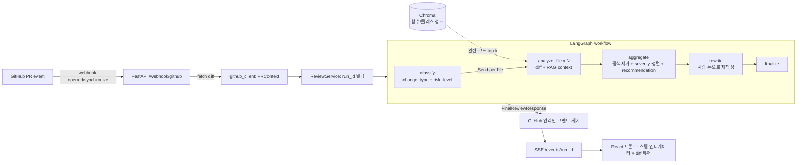

# PrSense — GitHub PR 자동 리뷰 에이전트

PR이 열리면 변경사항을 분석해 **인라인 리뷰 코멘트**를 자동으로 남기는 에이전트.
LangGraph 오케스트레이션 + 코드베이스 RAG + 구조화 출력(Pydantic) + 실시간 SSE 진행 표시가 핵심이다.

포트폴리오용으로 코드 품질·아키텍처·문서화를 모두 신경 쓴 구성이다.

## 아키텍처



**데이터 흐름:** Webhook → PR diff 수집 → 분류 → 파일별 병렬 분석(Send fan-out, 각자 RAG 조회) →
종합/재작성 → SSE로 진행 상황 스트리밍 + 프론트 렌더링 → (버튼/자동) GitHub 게시.

## 프로젝트 구조

```
PrSense/
├── docker-compose.yml
├── backend/
│   ├── Dockerfile
│   ├── requirements.txt
│   ├── .env.example
│   └── app/
│       ├── main.py                 # FastAPI 앱, /health, 라우터 등록
│       ├── config.py               # pydantic-settings 중앙 설정
│       ├── schemas.py              # ReviewComment 등 구조화 출력 계약
│       ├── github_client.py        # PR 조회 + 인라인 코멘트 게시 + 서명 검증
│       ├── rag/
│       │   ├── chunker.py          # 함수/클래스 단위 청킹 (AST)
│       │   ├── vectorstore.py      # Chroma 래퍼
│       │   └── indexer.py          # index_repo() + retrieve_related()
│       ├── agent/
│       │   ├── state.py            # ReviewState (comments reducer + final_comments)
│       │   ├── prompts.py          # 노드별 시스템/유저 프롬프트
│       │   ├── llm.py              # 모델 팩토리 + mock 모드
│       │   ├── nodes.py            # classify / analyze_file / aggregate / rewrite
│       │   └── graph.py            # Send fan-out 그래프 정의
│       ├── services/
│       │   └── review_service.py   # 실행 오케스트레이션 + SSE 이벤트 저장소
│       └── api/
│           ├── routes_webhook.py   # POST /webhook/github, /webhook/review/...
│           ├── routes_prs.py       # GET /prs, 상세, diff, publish
│           └── routes_events.py    # GET /events/{run_id} (SSE)
├── frontend/                       # Vite + React + TS
│   └── src/
│       ├── api/client.ts
│       ├── types/index.ts
│       ├── components/             # SummaryCard, StepIndicator, DiffViewer, CommentCard
│       └── pages/                  # PRList, PRDetail
└── eval/
    ├── test_real_prs.py            # 실제/샘플 PR 실행 스크립트
    ├── compare_reviews.py          # 사람 리뷰 vs 에이전트 precision/recall
    └── sample_human.json
```

## 핵심 설계 결정

| 주제 | 결정 | 이유 |
|---|---|---|
| 병렬 분석 | LangGraph `Send` API로 파일별 fan-out | 파일 수에 따라 동적 병렬, 단일 노드 병목 제거 |
| 구조화 출력 | 모든 LLM 호출에 `with_structured_output(Pydantic)` | 스키마 위반 코멘트가 GitHub에 게시되는 사고 방지 |
| 신뢰도 | `confidence < 0.6` → "확인 필요" 배지 + 옅은 표시 | 환각 가능성이 있는 지적을 숨기지 않고 격리 |
| RAG 청킹 | Python은 AST 기준 함수/클래스 단위, 나머지는 120줄 윈도우 | 심볼 단위 검색이 파일 전체 임베딩보다 노이즈가 적음 |
| SSE | append-only `rec.events` 폴링 방식 | 여러 클라이언트가 동시에 구독해도 이벤트 유실 없음 (단일 큐 소비 방식의 단점 회피) |
| State 분리 | `comments`(reducer, 원시 누적) vs `final_comments`(overwrite, 최종본) | LangGraph가 state 미선언 키를 버린다는 점 + reducer 중복 누적 문제를 회피 |

## 실행 방법

### 1) 로컬 (mock 모드, API 키 불필요)

```powershell
cd backend
pip install -r requirements.txt
$env:MOCK_LLM = "true"
uvicorn app.main:app --reload --port 8000

# 새 터미널: 프론트
cd ../frontend
npm install
npm run dev   # http://localhost:5173
```

### 2) Docker Compose

```powershell
Copy-Item backend\.env.example backend\.env  # 키 입력
docker compose up --build
# backend :8000, frontend :5173
```

### 3) 실제 리뷰 트리거

```powershell
# GitHub 웹훅 대신 수동 트리거 (MOCK_LLM=false + 키 필요)
curl -X POST http://localhost:8000/webhook/review/psf/requests/1234
# 진행 상황: GET /events/{run_id} (EventSource)
# 결과: GET /prs/psf/requests/1234
# 게시: POST /prs/psf/requests/1234/publish
```

### 4) RAG 인덱싱

```python
from app.rag.indexer import index_repo
n = index_repo("/path/to/checkout", repo="owner/name")
print(n, "chunks indexed")
```

## 평가/검증

```powershell
cd backend
$env:MOCK_LLM = "true"
python ../eval/test_real_prs.py --sample --out ../eval/last_result.json
python ../eval/compare_reviews.py --human ../eval/sample_human.json --agent ../eval/last_result.json
# 실제 PR: python ../eval/test_real_prs.py --repo psf/requests --pr 1234
```

매칭 기준: 동일 파일 + ±3줄 윈도우 → precision/recall/F1 출력.
샘플 기준 실측 예시: `precision 0.40 / recall 1.00 / F1 0.57` (mock 휴리스틱 기준).

## API 요약

| 메서드 | 경로 | 설명 |
|---|---|---|
| POST | `/webhook/github` | GitHub PR 이벤트 수신 (opened/synchronize) |
| POST | `/webhook/review/{repo}/{pr}` | 수동 리뷰 트리거 (오프라인 files 주입 가능) |
| GET | `/prs/` | 리뷰된 PR 목록 |
| GET | `/prs/{repo}/{pr}` | 리뷰 상세 (classification + comments) |
| GET | `/prs/{repo}/{pr}/diff` | diff 뷰어용 patch |
| POST | `/prs/{repo}/{pr}/publish` | GitHub 인라인 코멘트 게시 |
| GET | `/events/{run_id}` | SSE 진행 스트림 (분류중→분석중→종합중→완료) |
| GET | `/health` | 헬스 + mock 여부 |

## ReviewComment 스키마

```python
class ReviewComment(BaseModel):
    file: str            # repo-relative 경로
    line: int            # 새 파일 기준 줄번호
    severity: Literal["critical", "warning", "nit"]
    category: Literal["correctness", "security", "performance",
                      "maintainability", "style", "test"]
    comment: str         # 한국어, 간결, 인간 톤
    confidence: float    # 0..1, 0.6 미만은 "확인 필요"
    suggested_fix: str | None
```

## 한계와 다음 단계

- 인메모리 run 저장소 → Redis/Postgres로 교체 필요 (멀티 인스턴스).
- removed 파일·대용량 diff(>6000자 잘림)는 분석에서 제외/축소됨.
- AST 청킹은 Python만 정밀, 타 언어는 라인 윈도우.
- 다음 단계: 리뷰 코멘트에 대한 개발자 반응(👍/👎) 피드백 루프, 점진적 임계값 튜닝.
